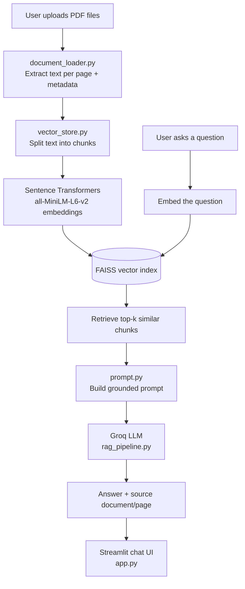

# Architecture / Workflow Diagram

```mermaid
flowchart TD
    A[User uploads PDF files] --> B[document_loader.py<br/>Extract text per page + metadata]
    B --> C[vector_store.py<br/>Split text into chunks]
    C --> D[Sentence Transformers<br/>all-MiniLM-L6-v2 embeddings]
    D --> E[(FAISS vector index)]
    F[User asks a question] --> G[Embed the question]
    G --> E
    E --> H[Retrieve top-k similar chunks]
    H --> I[prompt.py<br/>Build grounded prompt]
    I --> J[Groq LLM<br/>rag_pipeline.py]
    J --> K[Answer + source document/page]
    K --> L[Streamlit chat UI<br/>app.py]
```
